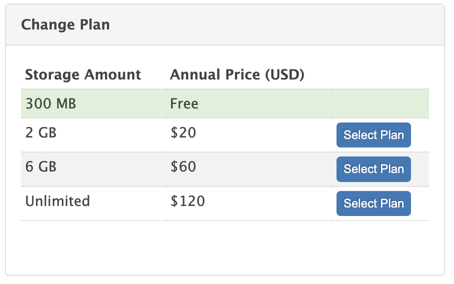
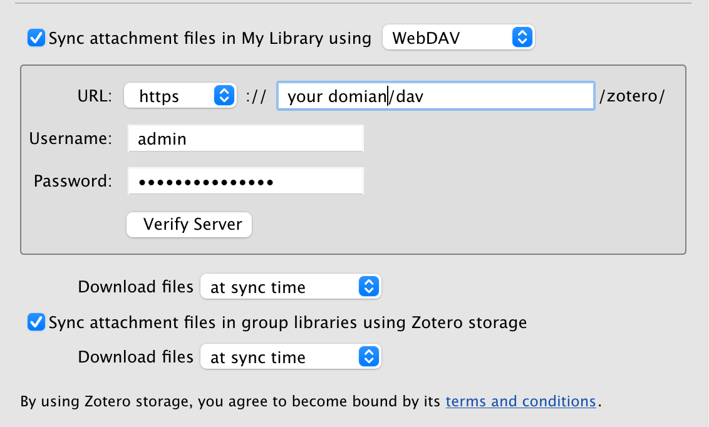

[Updated on 2025-09-22]: 由 Alist 切换至 [Openlist](https://github.com/OpenListTeam/OpenList)

如果你有跨设备使用 Zotero 的需求（比如笔记本+台式+iPad），那么文件同步是必不可少的。

登录 Zotero 账号后数据（Data Syncing，不包含附件）会自动同步。

文件同步（File Syncing）分为两种：

## Zotero 官方服务
    
Zotero 默认使用官方服务进行文件同步，有容量限制，一年 2GB 的容量需要 20 刀。预算充足、不想折腾且愿意支持官方的同学可以直接购买。
    

    
## WebDAV
    
与此同时，Zotero 支持使用 Webdav 同步文件，所以我们又有了新的选择：

### 坚果云

比较方便的方式是直接用坚果云这类提供 WebDAV 的云盘，不用自己折腾。免费的上传下载流量对于文献阅读量不大（别骂了）的同学来说已经够用了

### 自建 WebDAV 服务
如果你有 NAS 或者服务器的话，可以直接搭个 Webdav 的服务。

这里因为笔者本来就在使用 Openlist，所以直接用 Openlist 自带的 Webdav 服务。

Openlist 的安装方式有很多，推荐使用 [**Docker Compose**](https://doc.oplist.org/guide/installation/docker)，直接参考官方文档即可，在此不赘述。

参考官方文档中[关于 WebDAV 的部分](https://doc.oplist.org/guide/advanced/webdav)（Openlist 默认开启 WebDAV，无需手动设置）
    
**Zotero 中设置如下：**
    

    
- 你可以使用`https` + `domain/dav` 的方式
    
- 也可以使用`http` + `ip:port/dav` 的方式。

`Username` 和 `Password` 为你登录 Openlist 的密码。

由于 Openlist 可以创建多个账户，所以你也可以为多人提供互相隔离的文件同步服务。

## 直接使用 Onedrive 同步（强烈不推荐）

强烈不推荐使用 Onedrive 等同步盘直接同步 Zotero 数据和附件所在的目录。

比如直接把两个 Directory 设置成 Onedrive 目录地址。
    
虽然 Onedrive 在大部分时候同步是正常且及时的，但少数情况下可能会抽风。
    
这个时候如果你在两台设备上分别进行了操作，同步的时候就会冲突，然后就可能产生难以预料的影响（亲身教训）。