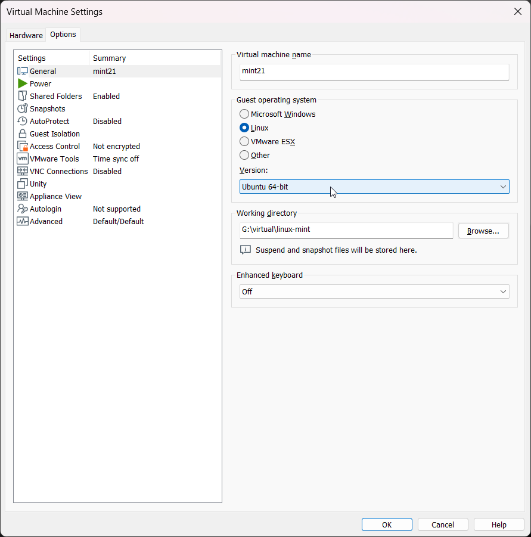
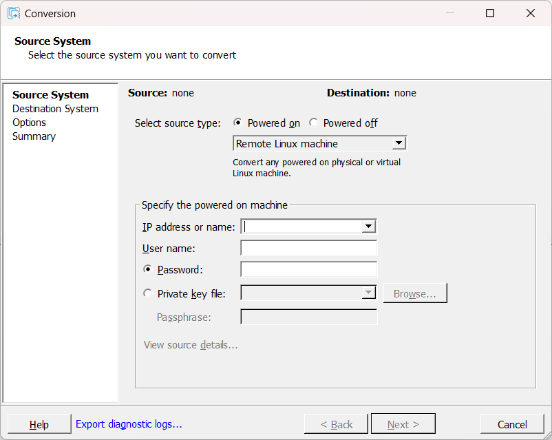

本文记录了备份物理机 Linux Mint 系统并且恢复至虚拟机中正常运行的过程。

**背景**：准备闲置傻大黑粗的神舟笔记本（17寸，一学期开不了几次，都在用 mac 和台式机），备份系统后在虚拟机中使用。

## 备份物理机系统

1. 首先从官网下载 [Clonezilla](https://clonezilla.org/downloads.php) 镜像并制作启动盘（推荐使用 VTOYEFI）
    
2. 进入 BIOS 选择装有 Clonezilla 的设备启动，根据指引一步步选择即可。
    1. 提供简体中文选项
    2. 支持 备份\恢复至 远程地址
    3. 引导非常详细，每个选项都有注解
    
    有不懂的地方可以参考[官方教程](https://clonezilla.org//clonezilla-live-doc.php)
    

## 恢复至虚拟机

直接使用 clonezilla 的镜像创建一个虚拟机（注意不是原物理机系统的镜像）

正常启动然后跟随指引一步步选择，存放导出镜像的设备可以通过“挂载 removable devices”的方式被读取到。

注意默认模式下给虚拟机分配的硬盘空间应**不小于**原物理机的硬盘空间，当然你也可以选择等比例缩放（k1 Create partition table proportionally）的模式


部分外部介质可能无法被 Clonezilla 读取，出现此情况时考虑更换外部介质。

软件问题最终指向硬件问题。


### 可能的大坑

如果迁移成功后无法启动，极有可能是 固件类型（firmware type）的问题，固件类型应与物理机上使用的一直（legacy or UEFI）

在 [settings] → [Options] → [Advanced] → [Firmware type] 中修改为 BIOS 或 UEFI。

若 UEFI 选项为灰色，在 [General] 中将 Version 改为 “Ubuntu 64-bit” 即可（笔者使用的是 Linux Mint，基于 Ubuntu 开发，其他的 Linux 版本可能略有不同）



## Alternative: VMware vCenter Converter

如果你是 ESXi 或者 vCenter 用户，那么你有更方便的方案可以选择，无需使用任何外部介质。

一下内容以迁移 Linux 系统为例，迁移 Windows 系统请自行探索。

1. 下载并安装 [Vmware vCenter Converter](https://support.broadcom.com/group/ecx/productfiles?subFamily=VMware%20vCenter%20converter&displayGroup=Standard&release=6.6.0&os=&servicePk=203348&language=EN)
2. 打开软件，点击 [Convert Machine]
3. “Source Machine” 填写需要迁移的 Linux 系统的信息。
    1. 根据[官方文档](https://docs.vmware.com/en/vCenter-Converter-Standalone/6.6/vcenter-converter/GUID-E6C55568-EE61-4D1F-A3DC-71269790D9FD.html)，你需要使用 root 用户或者”无需输入密码即可执行 sudo 命令的用户“。
    2. 待迁移 Linux 系统必须能正常被 ssh 连接（无法连接时请检查 sshd 是否正确安装和配置，参考 [Ubuntu 官方文档](https://ubuntu.com/server/docs/openssh-server)）
    3. 运行 Converter 的机器需要能通过网络访问到待迁移机器
    
    
    
    如果连接 root 用户出现报错”Access Denied“，通常是权限问题。
    
    修改待迁移 Linux 系统的 sshd 配置文件
    
    ```bash
    $ sudo vim /etc/ssh/sshd_config
    ```
    
    找到以下行并进行修改 
    
    `#PermitRootLogin prohibit-password`
    
    如果您使用私钥进行登录，取消注释即可，否则还需要将 `prohibit-password` 改为 `yes` （不推荐）
    
4. 填写目标系统（ESXi or vCenter）的信息。
5. 设置一些选项并开始迁移。