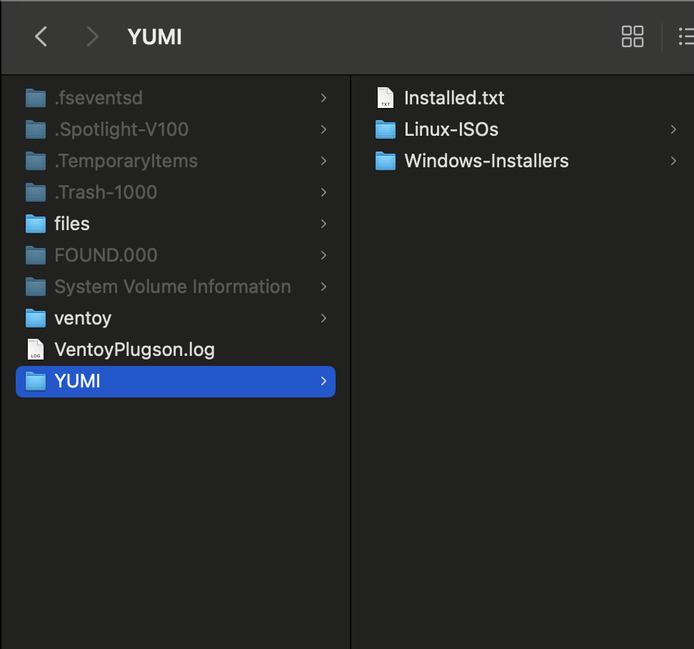

[项目 Github 地址](https://github.com/ventoy/Ventoy)

如果你有安装系统或者使用 PE 修复现有系统的需求，那你一定绕不开一件事——制作启动盘。

现在制作启动盘迎来了终极解决方案：VENTOY

VENTOY 的主要优点：

1. 直接放入操作系统 iso 文件即可使用，无需烧录或格式化硬盘
2. 可同时存放多个操作系统（Windows/Linux 均可）
3. U 盘剩余空间仍可正常使用

## 如何安装 & 使用

参考[官方文档](https://www.ventoy.net/en/doc_start.html)

Windows 和 Linux 都有 GUI 的安装程序，根据指示安装即可

安装成功后将系统镜像根据类别拖入 YUMI 文件夹中的对应位置即可（Linux-ISOs or Windows-Installers）

VENTOY 文件结构示意图:

