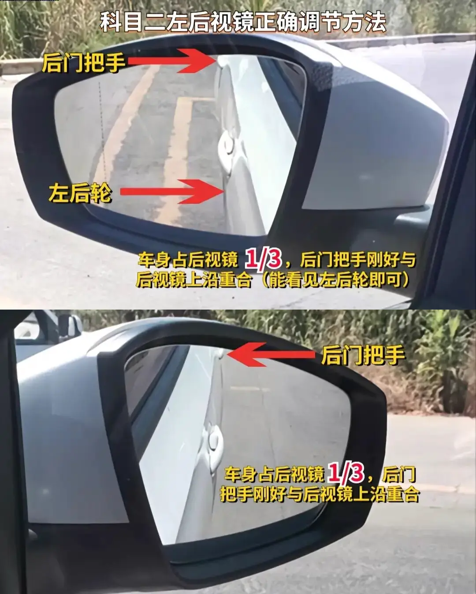
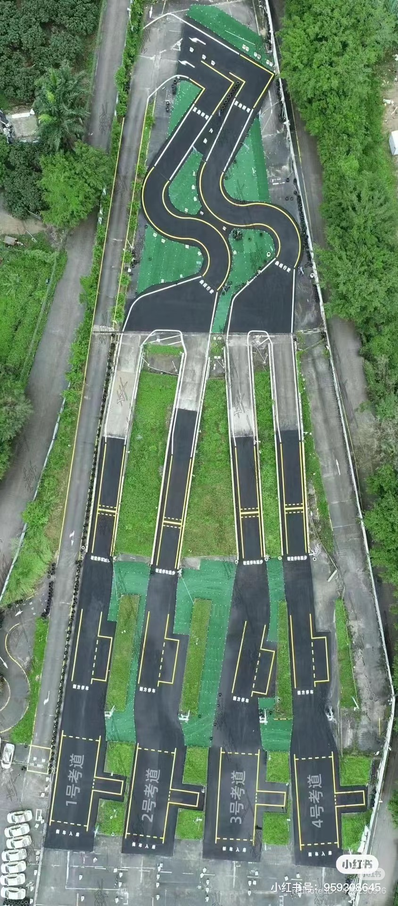

## 前言

本来应该在大一暑假完成的驾考拖到了大四，最终在 March 26, 2025 拿到了 C2 驾驶证，顺带记录一下过程中的一些经验。

报名地点为深圳，驾校为深港驾校，科一至科四全部一次通过。科一在过年前考完，科二至科四练车加考试总计一个月出头。

### 报考手动挡（C1）还是自动挡（C2）？

评价为根据需求选择，未来的趋势是电车越来越多（连档位都没有了），自动驾驶越来越成熟（驾驶证只是智驾的合法化通行证），需要手动挡的场景越来越少。

- 如果你追求驾驶乐趣，或者生产力场景（部分公务员岗位都需要 C1 驾照）需要开手动挡的车，那就考 C1。
- 如果你只是为了拿证上路，那就考 C2，C2 的考试难度比 C1 低很多，驾校报名费通常只贵小几百。

## 科目一

没啥好说的，app 上刷题加模拟考，连续三次通过就可以去预约考试了。

也可以在微信、小红书等平台找一下知识点总结，方便记忆。

## 科目二（2025.3.27）

以深圳牛成科目二考场为例，绿色部分为考场专属

**自动挡**科目二共有倒车入库，侧方位停车，曲线行驶，直角转弯四个内容，**不考**半坡起步。

科目二不需要踩油门，全程踩刹车控制车速即可（完成一个项目进入下一个项目前随便停车，考试项目中踩停会扣 5 分）。不同身高点位不同，练车时注意试验和记忆。

**脚慢手快，公式做题。**

### 准备阶段

1. 系好安全带，脚踩住刹车
2. 调整座椅，腿离前方三指，头顶离上方一拳，确保自己能看到部分”考试车“三字
3. 调整后视镜，按照下图标准调整即可
    

    

### 倒车入库

1. 右倒库
    1. 松手刹，挂 D 挡，缓抬刹车向前行驶至黄线到车窗一半位置停车。
    2. 挂倒档，后退至黄线距离左侧倒车镜把手（就是倒车镜和车身连接的那一段）**一指时向右打死。**
    3. 观察左后视镜，车位出现**第一个直角**时回半圈（回到右打一圈的程度）。
    4. 车位出现**第二个直角**时回正方向盘，同时微调方向盘使车身与边线平行（后方比前方稍窄，）。
2. 左倒库
    1. 挂 D 挡，向前行驶至黄色虚线在肩膀后方时左打一圈半
    2. 待边界线出现在车窗一半位置时停车（此时前轮已经完全约过检测线），挂倒挡，开始倒车
    3. 左后视镜中出现第二条（从左往右数）虚线时左打死
    4. 第一条虚线快要结束时回半圈，目光看向右后视镜
    5. 车身右侧与边线平行时方向盘回正，看左后视镜微调方向盘使车身与边线平行
    6. 待车位虚线距离左侧倒车镜把手一指时停车
3. 右出库
    1. 挂 D 挡，向前行驶至黄色虚线在肩膀后方时右打一圈半，车身摆正后回正方向盘，驶出考试区域

### 侧方位停车

1. 停车
    1. 保持“考试车“的“车“字偏道路中心右侧向前缓慢行驶
    2. 看不到黄线时停车
    3. 继续前进，直角到倒车镜 1/3 处停车，方向盘右打一圈，挂倒挡，开始倒车
    4. 观察左后视镜，第两条虚线快要出完时向左回一圈（此时方向盘已经回正）
    5. 偏头从左后视镜观察轮胎，左后轮压线后左打死，待车身与边线平行后停车（方向盘保持左打死状态）
2. 出库
    1. 打左灯，挂 D 挡出库
    2. “车”字碰黄线后方向盘回正
    3. 试字碰黄线后右打一圈
    4. “车“字回到路中间后回正方向盘

### 曲线行驶

挂科率很高的项目，通过要点就是不要凭感觉，**根据点位调整方向盘**

1. 保持“车”字居中入弯
2. 车前盖左前角碰到边线时**左打一圈**，保持左前角在边线上移动，超出边线再左打 90 度，回到边线后右打 90 度（此时方向盘为左打一圈）
3. 车前盖左前角碰到左边线时回正方向盘
4. “考”字碰到左边线时方向盘**右打一圈**，保持“考”字在边线上移动，跑到边线外侧再向右多打 90 度，回到边线上则左打 90 度。曲线行驶通过后马上进入直角转弯项目。

### 直角转弯

1. 驶出 S 弯后在“试”的言字旁碰到右边线后回正方向盘，**打左灯（熄灭的话立马补灯）**，之后微调方向盘始终保持言字旁贴着右边线（的左侧）行驶
2. 左侧车门门把手对齐直角时立马左打死，待“车“字回到路中间后立马回正，驶出考试区域，考试合格。

### 深圳牛成科目二考场

考场地图（图源小红书）如下：

- 开考前可以直接从旁边进入看看考场情况
- 自动挡科目二通过侧方位停车项目后直接开过半坡起步项目即可，不用进行考试。
- 1、3 号线和 2、4 号线进入曲线行驶前的动作有所不同，到时候教练应该会教

## 科目三（2025.3.26）

以东周科目三考场为例，粉红色部分为考场专属，非技术动作

### 通用注意事项

变道一定记得打灯，转向灯打满 3s 后再变道

### 准备

右后门下车后从车左后方开始绕车一周

上车系安全带，调整座椅，检查灯光

### 模拟夜间灯光考试

总共就 11 种情况，全部记住就行。

### 起步

打左灯，踩刹车（我习惯上车之后一直踩着），放手刹（注意检查手刹红灯是否熄灭），挂D挡，左后视镜观察没车后向左变道。

- 向**左**变道方法

    停车，打左灯，方向盘向左打 90 度，待”考试车”的考字完全进入车道右边后迅速右打 90 度，待前挡风玻璃左下角进入车道后回正

- 向**右**变道方法

    停车，打右灯，方向盘向右打 90 度，待前挡风玻璃左下角进入车道后迅速左打 90 度，待前挡风玻璃左下角再次靠近边线后回正

### 行驶过程

保持车速在 25 码左右，东周考场要求 20 码车速以上里程达到 1km

左转右转走中间，掉头走最左

**东周三号线**

1. 自行变更车道：
    1. 起步后右边没车自行停车变右
    2. 超车动作完成后自行停车变左
2. 公交站台：掉头后左侧**第 7 棵树**（右侧第一个路口）点刹 2-3 次
3. 掉头左打死

**东周六号线**

1. 会车动作：听到“请会车”后停车变右，听到“请变更车道”后停车变左
2. 公交站台：
    1. 右转后肩膀对准第一个白色电线杆（上面内容是禁止教练车进入）停车，打左灯，变到中间车道
    2. 掉头后听到“前方路口左转”时打左灯，车头盖住“左转直行”箭头后点刹 2-3 次
        
        此时放慢速度，前方三车道变四车道，走最左侧道路，不要压虚线
        
3. 最后一段路听到“直线行驶结束”后停车打右灯，没车后变右
4. 掉头左打死

**东周七号线**

1. 会车动作：听到“请会车”后停车变右，听到“请变更车道”后停车变左
2. 公交站台：掉头后过一个红绿灯数第四棵树（小树）点刹 2-3 次
3. 自行变更车道：通过最后一个路口（左转后第一个路口，左前方有房地产的电话号码广告）后自行停车变右靠边
4. 掉头左打一圈加90度

### 前方终点区域

听到语音播报“**前方终点区域**”后，停车，打右转向灯，确认前方没车后松刹车缓慢向前

### 靠边停车

靠边停车需要在 30s 内完成

语音播报“**请靠边停车**”后，打右灯（如果刚刚没打的话），**不要**踩刹车

方向盘右转30度至“试”字言字旁在边线中间后方向盘左转30度，待言字旁再次回到边线中间后回正，回正后继续行驶一小段距离，言字旁在线中间走就及时踩停，拉手刹，挂p挡，等待播报“考试合格”

## 科目四（2025.3.26）

用 app 刷题加模拟考试即可，总体比科目一简单不少。

深圳科目四目前（2025.3.26）只能在圆山考场参加，第一次随到随考（科目三路考通过当天就可以考），之后需要进行预约。

几个需要注意的点：

- 常用交警手势，注意交警面向的是你还是别的车道
- 中型客车核载 19 人
- 特殊情况（急弯，冰雪等）的限速一般是 30 码

## 科二、科三联考

深圳预约一次科二、科三考试通常需要等待较长的时间（尤其是热门考场），因为考位的安排主要由你**上一次进行考试到今天的时间间隔**决定，但科二、科三联考可以让你短时间内联考科二、科三，快速拿证（前提是你每个考试都通过了…）。

操作方法为科目一通过一段时间且没有参加过科二考试、并且**科二、科三学时都已经刷够**的情况下，在 12123 中同时预约科二和科三考试（科三不要自己选时间，直接点服从安排），两者间隔一周就来得及练车。

## 深港驾校（避雷）

- 深圳最大的直营驾校，在学院数量最多的情况下通过率长期处在前列。
- 报名费用较高，且考试费需要自己**垫付**，报销周期超过6个月，强烈差评。
- 科目三大多数教练都会要求模拟，模拟费用 **600 元** 6 圈，较为昂贵（主要是报名费之外的额外支出），属于教练的外快部分，这点差评。当然你也可以不模拟直接考试，挂了就把考试当模拟，反正报名费会报销，至于教练之后会不会给脸色就不好说了…。对于时间就是金钱、想要快速拿证的同学建议还是模拟一下。
- 总体上在深圳驾校当中应该属于中等水平（现在有收费更低不包考试费的班了，估计也是网上拖欠考试费的负面评价太多了）。鹏城驾校在网上负面评价比深港少很多，通过率也很高，我当时感觉塔家在小红书上营销太多就没敢报，有在鹏城拿到驾照的可以分享一下实际体验。

## 结语

最后祝大家科一至科四都一次通过，成为一名合格的驾驶员！