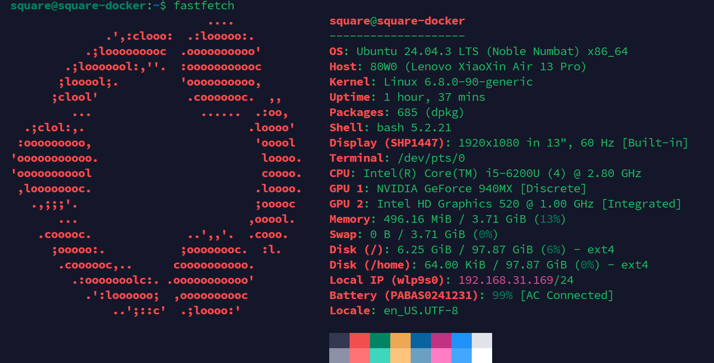

## 前言
手里有一台本科室友毕业不要了丢给我的上古联想小新轻薄本，六代 i5，4G 内存，250G 硬盘，之前一直闲置，最近有空了（不如说是给某些~~不良~~嗜好找点替代活动）折腾一下，让它发挥一下余热。
## 准备工作
这个部分在闲置笔记本上操作。
### 安装系统
1. 下载[官方镜像](https://ubuntu.com/download/server)。
2. 使用诸如 Ventoy，Rufus 等等的启动盘制作工具制作启动盘。
3. 按照官方引导一步步安装系统即可，**LVM**(Logical Volume Management) 功能建议启用，方便后续分区调整。
### 配置网络
由于这台笔记本并没有 RJ45 网口，所以只能使用无线网络。安装系统时会提示选择网络，选择无线网络并输入密码连接即可。

如果你在那一步没有连接网络，或者之后想修改网络配置，可以使用以下命令：
1. 运行 `ip a` 查看网络接口名称，例如 `wlp2s0`。
2. 运行 `sudo vim /etc/netplan/xxxx.yaml` （文件名称可能不同，请自行修改） 编辑网络配置文件，内容如下（需要根据实际接口名称修改）：
    ```
    network:
    version: 2
    renderer: networkd
    wifis:
        <INTERFACE_NAME>:
        dhcp4: true
        access-points:
            "<YOUR_SSID>":
            password: "<YOUR_PASSWORD>"
    ```
3. 保存并退出编辑器，应用配置：
    ```shell
    sudo netplan generate
    sudo netplan apply
    ```
### SSH
- 推荐安装时勾选 OpenSSH 的选项。
- 安装时未勾选的话则手动进行安装
```shell
sudo apt install openssh-server 
sudo ps -e |grep ssh # 显示sshd即安装成功
sudo systemctl status ssh # 查看 ssh service 状态
sudo systemctl start ssh # 一般默认开启，没有开启则手动开启
```
### 合盖不睡眠
毕竟是当小服务器用，平时是合盖状态，默认会直接睡眠。
1. 修改 Login Manager 的配置
    ```shell
    sudo vim /etc/systemd/logind.conf
    ```
2. 将 `#HandleLidSwitch=suspend` 改为`HandleLidSwitch=ignore`
3. 重启服务
    ```shell
    sudo systemctl restart systemd-logind
    ```
---

此时你已经可以把闲置笔记本放到无人在意的角落了，全程用主力电脑远程 ssh 连接即可。
### 使用密钥代替密码
1. 使用 ed25519 算法生成密钥（在本机终端而不是在闲置笔记本上操作）
    ```shell
    ssh-keygen -t ed25519 -a 256 -C "xxx@xxx"
    ```
2. 将密钥上传到服务器
    ```shell
    cat ~/.ssh/id_ed25519.pub | ssh username@remote_host_ip "mkdir -p ~/.ssh && cat >> ~/.ssh/authorized_keys"
    ```
3. 关闭 ssh 密码登录
    ```shell
    sudo vim /etc/ssh/sshd_config
    ```
4. 将其中的`#PasswordAuthentication yes`修改为`PasswordAuthentication no`
5. 重启 sshd 服务
    ```shell
    sudo systemctl restart sshd
    ```
### Fastfetch
不得不品的一环。
```shell
sudo add-apt-repository ppa:zhangsongcui3371/fastfetch
sudo apt update
sudo apt install fastfetch
```


爽。
### btop
```shell
sudo apt install btop
```
### smartctl
检查一下硬盘状况
```shell
sudo apt install smartmontools
sudo smartctl -a /dev/nvme0n1 # 设备名称可以用 lsblk 查看
```
### YABS
没事跑个分。
```shell
curl -sL https://yabs.sh | bash
```
### 断电自动关机
用笔记本当轻量服务器有一个好处，就是相当于自带了一个 UPS。
这里添加一个定时脚本，检测到断电以及低电量时自动关机。
1.  确认电池标识符（如果是 `BAT0` 的话后续请自行修改，这台笔记本是 `BAT1`）
    ```shell
    ls /sys/class/power_supply/
    ```
2. 创建并编辑脚本
    ```shell
    sudo vim /usr/local/bin/battery_monitor.sh
    ```
    添加如下内容
    ```shell
    #!/bin/bash

    THRESHOLD=50

    CAPACITY=$(cat /sys/class/power_supply/BAT1/capacity)
    STATUS=$(cat /sys/class/power_supply/BAT1/status)

    # Discharging && capacity < Threshold
    if [ "$STATUS" = "Discharging" ] && [ "$CAPACITY" -lt "$THRESHOLD" ]; then
        # log
        echo "$(date): Battery is at $CAPACITY%. Shutting down safely." >> /var/log/battery_shutdown.log
        
        # safely shutdown
        /sbin/shutdown -h now
    fi
    ```
    赋予脚本执行权限
    ```shell
    sudo chmod +x /usr/local/bin/battery_monitor.sh
    ```
3. 设置定时任务
    ```shell
    sudo crontab -e
    ```
    末尾添加一行
    ```shell
    * * * * * /usr/local/bin/battery_monitor.sh
    ```
---

## Docker
说实话很多东西还是大公司提供的云服务用起来方便，自己对一些薅羊毛的自动化脚本也不感兴趣，所以只部署了网络唤醒和几个 PT 相关的容器。

- **按照[官方文档](https://docs.docker.com/engine/install/ubuntu/)安装 Docker Engine 以及 Docker Compose。**
- 以下全部 Docker Compose 配置文件均通过 `sudo docker compose up -d` 启动。
### 配置代理
1.  创建配置文件
    ```shell
    sudo mkdir -p /etc/systemd/system/docker.service.d
    sudo vim /etc/systemd/system/docker.service.d/http-proxy.conf
    ```
2.  添加以下内容
    ```shell
    [Service]
    Environment="HTTP_PROXY=http://IP:port"
    Environment="HTTPS_PROXY=http://IP:port"
    Environment="NO_PROXY=localhost,127.0.0.1"
    ```
3.  重启 Docker
    ```shell
    sudo systemctl daemon-reload
    sudo systemctl restart docker
    ```
### 挂载 NTFS 设备
存储电影电视剧的硬盘原本在 Windows 上运行，考虑到兼容性和可迁移性，不做格式化，直接在 Linux 下挂载使用。
- 创建挂载点
    ```shell
    lsblk -f # 查看移动硬盘 UUID
    id # 查看用户 id 
    sudo mkdir -p /mnt/Videos # 创建你希望的挂载点
    sudo vim /etc/fstab
    ```
- 添加以下内容（需要根据实际UUID、挂载点、uid和gid修改）
    ```ini
    UUID=371F208A1CC186D2 /mnt/Videos  ntfs-3g  defaults,uid=1000,gid=1000,dmask=022,fmask=133,windows_names  0  0
    ```
- 测试挂载情况
    ```shell
    sudo mount -a
    ```
验证无误的话下次开机会自动挂载
#### 卸载设备
```shell
lsblk
sudo umount <MOUNTPOINTS>
```

### 配置 Samba 共享

曾经折腾过一阵子 Jellyfin，后来觉得花这么多时间折腾那个海报墙，还不如直接开个 Netflix 会员。现在直接用 Samba 共享硬盘内容，其他设备直接访问，或者使用 Infuse 或者 SenPlayer 挂载后播放。

- 安装 Samba
    ```shell
    sudo apt update
    sudo apt install samba
    sudo vim /etc/samba/smb.conf
    ```

- 在文件末尾添加如下内容
    ```ini
    [Videos]
        path = /mnt/Videos # 根据实际挂载点修改
        browsable = yes
        writable = no
        guest ok = yes
        read only = yes
        create mask = 0755
        directory mask = 0755
    ```
- 重启 Samba 服务
    ```shell
    sudo systemctl restart smbd
    ```
- 设置 Samba 账户密码
    ```shell
    sudo smbpasswd -a <your_username>
    ```
- 在其他设备上访问共享
    - Windows 资源管理器地址栏输入 `\\Server IP\Videos`
    - macOS Finder 菜单栏选择 前往 -> 连接服务器，输入 `smb://Server IP/Videos`


### Qbittorrent WebUI
玩 PT 还是少不了它。
```yml
services:
  qbittorrent:
    image: lscr.io/linuxserver/qbittorrent:5.1.4
    container_name: qbittorrent_5.1.4
    # network_mode: "host"
    environment:
      - PUID=1000
      - PGID=1000
      - TZ=Etc/UTC
      - WEBUI_PORT=21088
      - TORRENTING_PORT=16881
    volumes:
      - ./config:/config
      # path for vuetorrent ui
      - ./vuetorrent:/vuetorrent
      # Download path
      - /mnt/Videos/Contents:/downloads
    ports:
      - "21088:21088"
      - "16881:16881"
      - "16881:16881/udp"
    restart: unless-stopped
```
- 新版本首次登陆时账号为 `admin`，密码为随机生成，使用 ` sudo docker logs qbittorrent_5.1.4` 查看。
### IYUU
用于自动辅种
```yml
services:
  iyuuplus:
    image: iyuucn/iyuuplus-dev:latest
    container_name: IYUUPlus
    restart: unless-stopped
    ports:
      - "8780:8780"
    volumes:
      - ./iyuu:/iyuu
      - ./data:/data
    # user: "1000:1000"
```
### MoviePilot
用于自动签到以及更多高级功能。
```yml
services:
  moviepilot:
    image: jxxghp/moviepilot-v2:2.8.1-1
    container_name: moviepilot-v2
    restart: unless-stopped
  
    stdin_open: true
    tty: true
    hostname: moviepilot-v2
    ports:
     - '13000:3000'
     - '13001:3001'
    volumes:
      - '/mnt/Videos:/media'
      - './config:/config'
      - './core:/moviepilot/.cache/ms-playwright'
      - '/var/run/docker.sock:/var/run/docker.sock:ro'
    environment:
      - 'NGINX_PORT=3000'
      - 'PORT=3001'
      - 'PUID=0'
      - 'PGID=0'
      - 'UMASK=000'
      - 'TZ=Asia/Shanghai'
      - 'SUPERUSER=admin'
      - 'SUPERUSER_PASSWORD=Password'
```
### UpSnap
用于局域网内网络唤醒。
```
services:
  upsnap:
    container_name: upsnap
    image: ghcr.io/seriousm4x/upsnap:5 # images are also available on docker hub: seriousm4x/upsnap:5
    network_mode: host
    restart: unless-stopped
    volumes:
      - ./data:/app/pb_data
```
