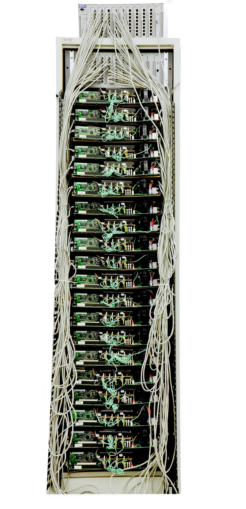

## 历史与评价

PageRank 由 **Larry Page** 和 **Sergey Brin** 于 1996 年在斯坦福大学提出，最初作为研究项目 "BackRub" 的一部分，旨在**通过分析网页之间的链接关系来评估网页的相对重要性**。

1998 年，两人撰写了技术报告 _'The PageRank Citation Ranking: Bringing Order to the Web'_，并于同年发表了阐述搜索引擎整体架构的奠基性论文 _'The Anatomy of a Large-Scale Hypertextual Web Search Engine'_。同年 9 月，他们以此技术为核心创立了 Google 公司。一段伟大的旅程由此开始。

PageRank 的名称既取自 Larry Page 的姓氏，也一语双关地表达了 "网页排名"（Page Rank）的含义。

一段来自 Gemini 3.5 Flash 的对 PageRank 算法的评价：

> PageRank 是信息检索史上的范式革命，它首次将网页重要性的评估从“孤立的内容文本检索”升维到“全局的网络拓扑投票”，不仅奠定了现代万维网的信任与流量秩序，更作为工业界规模最大、最成功的图论应用，开启了数据结构决定商业帝国的先河。

## 算法

### 基本假设

PageRank 的核心思想基于三条直觉：

1. **数量假设**：一个网页被越多的其他网页链接，则该网页越重要。
2. **质量假设**：一个网页被越重要的网页所链接，则该网页也越重要。
3. **随机冲浪者假设**：假设一个用户在网页上随机点击链接。他每到达一个页面，点击该页面上任何一个出链的概率是**完全均等**的。

根据假设 1 和 2，PageRank 将网页之间的链接视为一种**加权投票**行为（有美式民主那味儿了）。

假设 3 的隐含意思为“用户下一步去哪个网页，仅取决于他**当前所在的网页**有哪些出链，与他之前浏览过什么网页完全无关”，这种“无记忆性”使得 PageRank 模型可以被视为**马尔可夫链（Markov Chain）**，这为后续一系列的数学推导奠定了基础。

### 初始形式

基于上述假设，一个页面的 PageRank 值可以被递归地定义为 _所有链向它的页面的 PageRank 值除以各自出链数的总和_：
$$
PR(p_i) = \sum_{p_j \in M(p_i)} \frac{PR(p_j)}{L(p_j)} \tag{1}
$$

其中：

- $PR(p_j)$ 表示第 $j$ 个网页的 PageRank 值
- $p_i$ 表示第 $i$ 个网页；
- $M(p_i)$ 是链向 $p_i$ 的网页集合（即 $p_i$ 的入链来源）；
- $L(p_j)$ 是网页 $p_j$ 的出链总数。

为了更清晰地描述，我们可以将其转换为**矩阵形式**。假设共有 $N$ 个网页，定义原始链接转移矩阵 $\mathbf{A} \in \mathbb{R}^{N \times N}$（按列定义）：

$$
\mathbf{A}_{ij} = \begin{cases}
\dfrac{1}{L(p_j)}, & \text{若 } p_j \text{ 链向 } p_i \\[8pt]
0, & \text{否则}
\end{cases} \tag{2}
$$

定义 PageRank 列向量 $\mathbf{v} \in \mathbb{R}^N$：
$$
\mathbf{v} = \big[ PR(p_1),\; PR(p_2),\; \dots,\; PR(p_N) \big]^{\mathsf{T}}
$$
公式 (1) 等价于从 $\mathbf{v} = \mathbf{A} \mathbf{v}$ 中求解列向量 $\mathbf{v}$。

喜欢线性代数的读者一定会注意到 $\mathbf{v}$ 是矩阵 $\mathbf{A}$ 特征值 $1$ 所对应的特征向量，这一点在后面会用到。

#### 概率视角的引入（马尔可夫链）

如果你不是很喜欢数学，也可以跳过所有相关部分，并不会实质影响你对 PageRank 算法工程性的理解。

前面我们提到，根据假设 3，PageRank 可以被视为马尔可夫链，于是我们可以把矩阵 $\mathbf{A}$ 视为一个**转移概率矩阵**（Transition Probability Matrix），$\mathbf{A}_{ij}$ 为用户当前在网页 $p_j$ 时下一步访问网页 $p_i$ 的概率 ；把向量 $\mathbf{v}$ 视为用户访问各个网页的概率分布。

假定某个时刻 $t$ 的概率分布为 $\mathbf{v}^{(t)}$ ，则 $t+1$ 时刻的概率分布为 $\mathbf{v}^{(t+1)} = \mathbf{A} \mathbf{v}^{(t)}$ 。

若初始概率分布为 $\mathbf{v}^{(0)}$ ，则 $t$ 时刻概率分布为 $\mathbf{A}^{t} \mathbf{v}^{(0)}$ 。如果 PageRank 值最终能够趋于稳定，那么将会存在 
$$
\displaystyle \lim_{t\to \infty} \mathbf{A}^{t} \mathbf{v}^{(0)} = \mathbf{v}
$$
$\mathbf{v}$ 即为马尔可夫链的平稳分布，此时有 $\mathbf{A} \mathbf{v} = \mathbf{v}$ 。

PageRank 计算的本质，就是在寻找一个**唯一且可收敛**的马尔可夫链的**平稳分布（Stationary Distribution）**。

为了确保这样一个唯一可收敛的平稳分布真正存在，马尔可夫链需要满足一些条件，在这里我们还用线性代数的语言给出转移矩阵对应的性质，见下表。

| 目标       | 马尔可夫链                                                 | 转移矩阵(线性代数)                               | 核心数学特征                 |
| :------- | :---------------------------------------------------- | :--------------------------------------- | :--------------------- |
| **存在性**  | **系统封闭**：转移概率总和为 1                                    | **列随机性** (Column-stochastic）：非负实矩阵列和等于 1 | 必然存在特征值 $\lambda = 1$  |
| **唯一性**  | **不可约 (Irreducible)** / 强连通（Strongly Connected）       | 不可约矩阵（一个矩阵无法通过行列置换被化简为分块上三角矩阵的形式）        | $\lambda = 1$ 的代数重数为 1 |
| **收敛性**  | **非周期 (Aperiodic）**：从一个节点出发，再回到该节点，所有返回可能的次数的最大公约数为 1 | 除了主特征值 1 之外，其余特征值的模均 $< 1$               | 幂迭代时次级特征向量随时间衰减        |
| **终极状态** | **遍历的 (Ergodic)**                                     | **Regular Stochastic Matrix**            | 必定收敛于唯一确定的稳态向量         |

- 列随机矩阵必然存在 $\lambda = 1$ 的特征值的证明：列随机矩阵的转置矩阵的行和全为 1。显然，全 1 向量 $\mathbf{1}$ 是其转置矩阵属于特征值 1 的特征向量。因为矩阵与其转置矩阵具有相同的特征值，这保证了原列随机矩阵必然存在一个 $\lambda=1$ 的特征值。
- 如果系统不封闭（概率泄漏），那么这个系统甚至不是一个合法的马尔可夫链。
- 在一些数学教材中，你可能会看到马尔可夫链遍历的条件是 正常返（Positive Recurrent）、不可约和非周期。其中对于 PageRank 模型这一有限状态系统，只要满足不可约，则正常返会被自动满足。

显然朴素形式的 PageRank 模型（或者说矩阵 $\mathbf{A}$）并不满足这些条件，具体讨论见下方。

### 存在的问题

朴素形式的 PageRank 存在以下几个问题：

1. **悬空链接（Dangling Links）** ：指向没有出链的网页的链接，导致系统总 PageRank 值（总概率）在迭代中不断“泄漏”，最终所有页面的权重都会趋于 0。
   这在数学上会使得 PageRank 系统不能构成合法的马尔可夫链（因为出现了概率泄漏）。用线性代数的话来说就是转移矩阵 $\mathbf{A}$ 出现全零列，破坏了**列随机性**。
2. **排名沉没（Rank Sink）**：**只进不出**的网页或网页组会像黑洞一样吸收所有流入的 PageRank 值，却不再向外传递。
   这在数学上破坏了**不可约性**。从图论视角看，不可约性等价于该矩阵对应的有向图是**强连通**的，这意味着系统中的任何一个节点，都能通过有限的步数，沿着有向路径到达系统中的任何另一个节点，只进不出的网页组显然破坏了这一点。

由于存在上述问题，马尔可夫链存在唯一可收敛的平稳分布的要求不被满足，迭代过程可能不收敛，或收敛到多个不同的解。

接下来的优化过程，在工程上解决了 Dangling Links 和 Rank Sink 造成的问题，在本质上通过修复马尔可夫链的数学性质（转移矩阵 $\mathbf{A}$） ，使其最终满足马尔可夫链平稳分布的数学要求。

### 问题1：悬空链接

> **悬空链接**：指向没有任何出链的网页（悬空节点）的链接。这些悬空节点使得转移矩阵 $\mathbf{A}$ 中出现全零列（对应列的和为 0 而非 1），破坏了矩阵的列随机性。在概率模型中，这意味着游走到悬空节点后无路可走，导致迭代过程中系统的总 PageRank 值不断向外部泄漏，最终所有页面的权重都会趋于 0。

一种经典的处理策略是**先移除、后放回**：在进行幂迭代计算时，暂时将所有悬空节点从系统中剔除，仅对剩下的节点组成的子图计算 PageRank；待收敛后，再将这些悬空节点放回系统，进行单次矩阵向量乘法求解这些悬空节点的 PageRank 值，随后进行归一化使权重总和为 $1$。

数学上完全等价的方法是直接在转移矩阵中将全零列替换为均匀分布列向量 $\frac{1}{N}\mathbf{1}$（即假设冲浪者到达悬空节点后，会随机跳转到网络中的任意一个页面）。令 $\mathbf{d}$ 为悬空节点指示向量（若 $L(p_j) = 0$ 则 $d_j = 1$，否则为 $0$），由此我们得到修复了概率泄漏的**列随机矩阵 $\mathbf{S}$**：

$$
\mathbf{S} = \mathbf{A} + \frac{1}{N} \mathbf{1} \mathbf{d}^{\mathsf{T}} \tag{3}
$$

当然在工程上不可能直接这么计算，因为这会让原本极度稀疏的矩阵变得稠密，超级计算机也未必扛得住。

### 问题2：排名沉没

> 排名沉没：即使解决了概率泄漏，网络中仍可能存在某些网页组(只进不出的网页在上一步中被干掉了）形成黑洞——它们相互链接，但**不向这组网页之外输出任何链接**。这导致流入的 PageRank 值只能沉没于此，经过多次迭代这些节点将垄断全部的排名权重。此外，这也使得马尔可夫链不满足不可约性和非周期性。

解决方案是引入**阻尼系数（damping factor）** $\alpha$（通常取经验值 $\alpha=0.85$）。

直观解释（或许有点牵强）采用**随机冲浪者模型**：假设冲浪者有 $\alpha$ 的概率顺着当前网页的链接继续点击，有 $1-\alpha$ 的概率感到厌倦，直接跳转到一个完全随机的页面。

在数学上，引入阻尼系数相当于在矩阵 $\mathbf{S}$ 的基础上加上了均匀分布的背景项，由此构造出最终的 **Google 矩阵** $\mathbf{G}$：
$$
\mathbf{G} = \alpha \,\mathbf{S} + \frac{1-\alpha}{N} \,\mathbf{E}  \tag{4}
$$

- $\mathbf{E} = \mathbf{1} \mathbf{1}^{\mathsf{T}}$ 是一个所有元素均为 1 的 $N \times N$ 方阵

引入阻尼系数使得 PageRank 系统中所有节点两两互相可达，符合**强连通**的定义。

引入阻尼系数的操作通过创造自环（一个网页有概率指向自己）使得马尔可夫链满足了**非周期性**：对于任意节点返回自身的最小次数均为 1，而 1 与任何正整数的最大公约数都是 1。

---

至此马尔可夫链遍历性所需的全部条件都已满足，唯一且可收敛的平稳分布存在。

> **Interpretation**：随机冲浪者在网页图上的随机游走构成了一个正常返、不可约、非周期的马尔可夫链。Google 矩阵 $\mathbf{G}$ 即为该链的一步转移概率矩阵。

PageRank 的最终求值等价于求解该马尔可夫链的**平稳分布**，即求解 $\mathbf{G}$ 的主特征向量 $\mathbf{v}$：
$$
\mathbf{G} \mathbf{v} = \mathbf{v} \tag{5}
$$

从线性代数的视角来看，根据 [**Perron-Frobenius Theorem**](https://en.wikipedia.org/wiki/Perron–Frobenius_theorem)， $\mathbf{G}$ 是一个**全正矩阵**（所有元素 $>0$），这从数学上保证了主特征值 $\lambda = 1$ 是**唯一的最大实特征值**以及其余特征值的绝对值均小于 1，因此幂迭代必定收敛。

写回标量形式的话长这样：
$$
PR(p_i) = \frac{1-\alpha}{N} + \alpha \sum_{p_j \in M(p_i)} \frac{PR(p_j)}{L(p_j)} \tag{6}
$$

- 若 $p_j$ 为悬空节点，则按照问题 1 中所讨论的那样，令 $L(p_j) = N$

## 计算

### 方法1：幂迭代法（Power Iteration）

幂迭代法是最经典、最符合算法直觉的 PageRank 求解方法。其核心思想是从任意初始向量出发，反复左乘 Google 矩阵 $\mathbf{G}$，直至满足收敛条件。

**算法流程**：

1. 初始化 $\mathbf{v}^{(0)} = \frac{1}{N} \mathbf{1}$
2. 迭代：$\mathbf{v}^{(k+1)} = \mathbf{G} \mathbf{v}^{(k)}$
3. 当 $\| \mathbf{v}^{(k+1)} - \mathbf{v}^{(k)} \|_1 < \varepsilon$ 时停止

等价地，使用标量形式避免显式构造稠密矩阵：
$$
PR^{(k+1)}(p_i) = \frac{1-\alpha}{N} + \alpha \sum_{p_j \in M(p_i)} \frac{PR^{(k)}(p_j)}{L(p_j)} \tag{7}
$$
计算时将悬空节点的 PageRank 值均匀分摊到所有节点即可。

**收敛性**：Google 矩阵 $\mathbf{G}$ 的第二大特征值满足 $|\lambda_2| \leq \alpha$ （参考论文 _The second eigenvalue of the Google matrix_），因此幂迭代以 $O(\alpha^k)$ 的速率收敛。当 $\alpha=0.85$ 时，约 $50\sim100$ 次迭代即可达到排序稳定。

#### 方法2：Gauss-Seidel 方法

Gauss-Seidel 迭代在每次更新时立即使用最新的 PageRank 值，比幂迭代收敛更快（约减少一半迭代次数）：
$$
PR^{(k+1)}(p_i) = \frac{1-\alpha}{N} + \alpha \sum_{\substack{p_j \in M(p_i) \\ j < i}} \frac{PR^{(k+1)}(p_j)}{L(p_j)} + \alpha \sum_{\substack{p_j \in M(p_i) \\ j > i}} \frac{PR^{(k)}(p_j)}{L(p_j)} \tag{8}
$$
此外，也存在基于特征值分解（Eigendecomposition）的直接解法，但由于需要对 $N \times N$ 的稠密矩阵做谱分解，仅适用于小规模图分析。

## 代码实现

以下为幂迭代法的示例代码，使用了稀疏矩阵进行优化。

```python
import numpy as np
import scipy.sparse as sp

def pagerank_power_iteration(adj_matrix, alpha=0.85, epsilon=1e-8, max_iter=500):
    """
    PageRank power iteration using a CSR sparse adjacency matrix.

    Args:
        adj_matrix (sp.csr_matrix): NxN CSR adjacency matrix. adj_matrix[i, j] = 1
            indicates a directed edge from node j to node i.
        alpha (float): Damping factor, default 0.85.
        epsilon (float): L1-norm convergence threshold.
        max_iter (int): Maximum number of iterations.

    Returns:
        np.ndarray: A 1D array containing the PageRank values for each node.
    """
    if not sp.isspmatrix_csr(adj_matrix):
        raise TypeError("adj_matrix must be a scipy.sparse.csr_matrix")

    N = adj_matrix.shape[0]
    
    # 1. Compute the out-degree for each node.
    out_degree = np.asarray(adj_matrix.sum(axis=0)).ravel()
    
    # 2. Identify dangling nodes (nodes with zero out-degree).
    is_dangling = (out_degree == 0)

    # 3. Build the sparse transition matrix once.
    inv_out_degree = np.divide(
        1.0,
        out_degree,
        out=np.zeros_like(out_degree, dtype=float),
        where=out_degree != 0,
    )
    M = adj_matrix @ sp.diags(inv_out_degree)
    
    # 4. Initialize the PageRank vector with a uniform distribution.
    v = np.ones(N) / N
    
    # 5. Power iteration.
    for i in range(max_iter):
        v_last = v.copy()
        dangling_sum = v_last[is_dangling].sum()
        
        # Iteration formula: sparse walk term + dangling-node compensation + teleportation.
        v = alpha * (M @ v_last + dangling_sum / N) + (1 - alpha) / N
        
        # 6. Convergence check using the L1 norm.
        if np.linalg.norm(v - v_last, ord=1) < epsilon:
            print(f"Converged at iteration {i + 1}")
            return v
            
    print("Warning: Reached maximum iterations without strictly converging.")
    return v
```

### 复杂度分析

直接使用稠密矩阵 $G$ 进行迭代计算的空间复杂度为 $O(N^2)$ ，时间复杂度为 $O(k\cdot N^2)$ ，其中 $k$ 为迭代次数（通常 $k \approx 50 \sim 100$）。

相比之下，标准幂迭代法的更新公式虽然可以写成按节点展开的标量形式，但在实现上本质上等价于一次稀疏矩阵-向量乘法，单词迭代的时间复杂度为 $O(|E|)$，其中 $|E|$ 是图的边数。
总体空间复杂度为 $O(N + |E|)$ ，时间复杂度为 $O(k \cdot |E|)$ 。

## 彩蛋

[谷歌的第一台服务器](http://infolab.stanford.edu/pub/voy/museum/pictures/display/0-4-Google.htm)由积木和廉价硬件“手搓”而成：


[1999 年谷歌的服务器](https://www.computerhistory.org/collections/catalog/102662167/)长这样：



可见依旧非常手搓。所以 PageRank 算法不高的复杂度和较快的收敛速度非常重要，它让 Google 能够在那样简陋的硬件上索引并排序互联网。

## 局限性

随着现代网络节点飙升至万亿级，PageRank 依赖的全局幂迭代机制遭遇了难以逾越的计算瓶颈。这迫使底层工程架构不得不从全局计算转向局部增量更新（如以块为单位的分布式图计算）。同时，尽管实时用户行为流（如点击率、Navboost 等）在现代排序模型中占据了决定性的权重，**但 PageRank 并未被完全取代**。它已被降维为底层的拓扑特征，与复杂的机器学习排序框架深度融合，继续作为衡量网页静态权威性的基石。

除此之外，PageRank 的原始算法在作弊对抗策略上存在天然空白。早期的 Black-hat SEO 通过构建链接农场、购买反向链接等手段即可轻易操纵排名。为了弥补这一结构性缺陷，各大搜索引擎后续逐步引入了基于种子信任传导的 TrustRank、针对链接图谱异常检测的算法（如 Google 的 Penguin Update），以及近年来由机器学习驱动的自动化反作弊系统（如 SpamBrain）。

## 参考文献

Page, L., Brin, S., Motwani, R., & Winograd, T. (1999). The pagerank citation ranking: Bring order to the web. In _Proc. of the 7th International World Wide Web Conf.–1998_.

Wikipedia contributors. (2026, May 21). PageRank. In _Wikipedia, The Free Encyclopedia_. Retrieved 11:16, May 21, 2026, from [https://en.wikipedia.org/w/index.php?title=PageRank&oldid=1355334917](https://en.wikipedia.org/w/index.php?title=PageRank&oldid=1355334917)

Wikipedia contributors. (2026, April 29). Perron–Frobenius theorem. In _Wikipedia, The Free Encyclopedia_. Retrieved 12:39, June 2, 2026, from [https://en.wikipedia.org/w/index.php?title=Perron%E2%80%93Frobenius_theorem&oldid=1351727526](https://en.wikipedia.org/w/index.php?title=Perron%E2%80%93Frobenius_theorem&oldid=1351727526)

Haveliwala, T. H., & Kamvar, S. D. (2003). _The second eigenvalue of the Google matrix_. Technical report, Stanford University.
