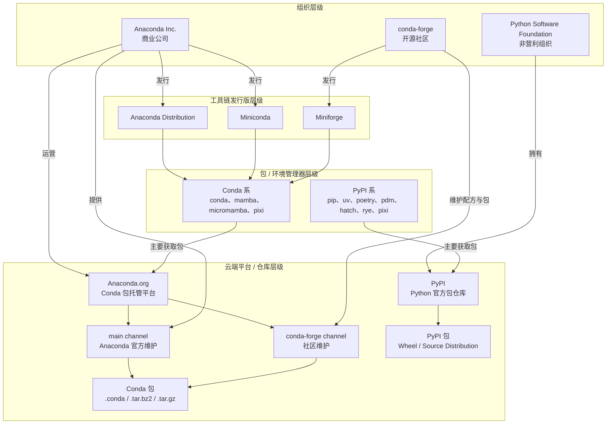

> [!Note]
> TL;DR: use [uv](https://docs.astral.sh/uv/)

## 前言

AI 生成的前言，感觉不太行啊。

Anaconda Distribution 曾是许多人进入 Python 数据科学生态的第一站，但随着安装体积、商业授权、依赖管理方式和开发工作流的变化，它已经不再是所有场景下的默认答案。Miniforge、Pixi、uv、Poetry，以及传统的 pyenv + pip + venv，都提供了各有侧重的替代方案。

本文会先梳理这些容易混淆的概念，再按 Conda 与 PyPI 两条生态路线介绍常见工具，比较它们的适用场景与取舍，最后给出一套简单的选择建议。

## 概念

先来理清几个概念，有好几个东西都可以被称作（或者是被简称作）Anaconda 或者 conda-forge，但它们其实是不同层级的东西。



### 组织层级

本期嘉宾包括：
- [Anancoda (Inc)](https://www.anaconda.com/)：商业公司
- [conda-forge](https://conda-forge.org/)：开源社区。
- [Python Software Foundation](https://www.python.org/psf-landing/)：非营利组织，管理和支持 Python，拥有 PyPI
### 云端平台/仓库层级
#### [Anaconda.org](https://anaconda.org/)

Anaconda (.org) 是一个云端托管平台，上面大部分是预编译好的二进制包，包含 Python、R、C++乃至软件程序（比如 Jupyter Notebook 和 RStudio）等多种包，里面有不同的 Channels，比如：
- `main`: 由 Anaconda 官方提供。
- `conda-forge`: 由 conda-forge 社区提供，二进制包托管在 anaconda.org 上，配方（recipe）托管在 Github 上。
- `robostack-jazzy` (ROS)、`nvidia` 等别的 channel。

Conda 包的分发格式也有两种，均不需要编译
1. `.conda`
2. `.tar.bz2` / `.tar.gz`
#### [PyPI](pypi.org)

PyPI，全称"Python Package Index"，Python 官方包仓库。
PyPI 包的分发格式有两种：
1. [Build Distribution](https://packaging.python.org/en/latest/glossary/#term-Built-Distribution)：Wheel (`.whl`) ，预编译二进制包格式
2. Source Distribution：`.tar.gz`
### 工具链发行版层级

这一层级通常就是你直接下载的那个安装包。
- [Anaconda Distribution](https://www.anaconda.com/download)
- Miniconda：相当于精简版的 Anaconda Distribution
- [Miniforge](https://github.com/conda-forge/miniforge)
### 包/环境 管理器层级

按照主要从哪个仓库下载包，可以大致将这些管理器分为“conda 系”和“pip 系”。

具体分类直接参考 [Conda & PyPI - Pixi](https://pixi.prefix.dev/latest/concepts/conda_pypi/#tool-comparison) 所提供的表格：

| Feature                | Conda                                                                                                                                                                                      | PyPI                                                                                                                                                                                                                                                                                                                                               |
| ---------------------- | ------------------------------------------------------------------------------------------------------------------------------------------------------------------------------------------ | -------------------------------------------------------------------------------------------------------------------------------------------------------------------------------------------------------------------------------------------------------------------------------------------------------------------------------------------------- |
| Package format         | Binary                                                                                                                                                                                     | Source & Binary (wheel)                                                                                                                                                                                                                                                                                                                            |
| Package managers       | [`conda`](https://github.com/conda/conda), [`mamba`](https://github.com/mamba-org/mamba), [`micromamba`](https://github.com/mamba-org/mamba), [`pixi`](https://github.com/prefix-dev/pixi) | [`pip`](https://github.com/pypa/pip), [`poetry`](https://github.com/python-poetry/poetry), [`uv`](https://github.com/astral-sh/uv), [`pdm`](https://github.com/pdm-project/pdm), [`hatch`](https://github.com/pypa/hatch), [`rye`](https://github.com/astral-sh/rye), [`pixi`](https://github.com/prefix-dev/pixi)                                 |
| Environment management | [`conda`](https://github.com/conda/conda), [`mamba`](https://github.com/mamba-org/mamba), [`micromamba`](https://github.com/mamba-org/mamba), [`pixi`](https://github.com/prefix-dev/pixi) | [`venv`](https://docs.python.org/3/library/venv.html), [`virtualenv`](https://virtualenv.pypa.io/en/latest/), [`pipenv`](https://pipenv.pypa.io/en/latest/), [`pyenv`](https://github.com/pyenv/pyenv), [`uv`](https://github.com/astral-sh/uv), [`poetry`](https://github.com/python-poetry/poetry), [`pixi`](https://github.com/prefix-dev/pixi) |
| Package building       | [`conda-build`](https://github.com/conda/conda-build), [`pixi`](https://github.com/prefix-dev/pixi)                                                                                        | [`setuptools`](https://github.com/pypa/setuptools), [`poetry`](https://github.com/python-poetry/poetry), [`flit`](https://github.com/pypa/flit), [`hatch`](https://github.com/pypa/hatch), [`uv`](https://github.com/astral-sh/uv), [`rye`](https://github.com/astral-sh/rye)                                                                      |
| Package index          | [`conda-forge`](https://prefix.dev/channels/conda-forge), [`bioconda`](https://prefix.dev/channels/bioconda), and more                                                                     | [pypi.org](https://pypi.org)                                                                                                                                                                                                                                                                                                                       |

后面的章节会对这些工具链发行版和管理器做更详细的介绍，这里只提供一个分类。

---

## 工具链与管理器（Conda）

conda/mamba 本身的优势：
- 交互式使用，“初期”人类使用友好
- 多语言与跨平台支持
- 强大的环境隔离与管理能力：conda 也是支持文件夹级别的环境管理的，参考 [conda: specifying-a-location-for-an-environment](https://docs.conda.io/projects/conda/en/latest/user-guide/tasks/manage-environments.html#specifying-a-location-for-an-environment)

conda/mamba 本身的劣势：
- 不原生基于配置文件进行依赖管理，尽管你可以导出和导入 `environment.yml`，26.5 及之后版本的 conda 还支持导出和导入 lockfile `conda-lock.yaml` 或 `pixi.lock`（不是哥们你怎么来了）
- 与 pip 混用易导致冲突：尽可减少在 conda 环境中使用 pip 安装 Python 包
- 由 Agent 使用时效果一般，需要显式将一些使用规则（比如尽可能不要使用 pip）写入 System Prompt 或 `AGENTS.md`
### [Anaconda Distribution](https://www.anaconda.com/download)

大概是很多人入坑的第一站。
默认 channel 是 `main`

优势：
- 功能完善、使用”简单“（毕竟可以用图形界面）
- 依然是行业的中流砥柱

劣势：
- 商业化加剧，对200人以上的组织需要收费（虽然可以理解）
- 默认情况下不登陆下载不了（现在有了 [Skip Registration](https://www.anaconda.com/download/success?reg=skipped) 的选项，看来悔改了）
- 愈发臃肿，倾向于让你安装塞了一坨东西的 anaconda navigator
- Pytorch 官方放弃 conda package (main channel) 的维护

Miniconda 属于精简版的 Anaconda Distribution，体积大概只有后者的 1/10。

### [Miniforge](https://github.com/conda-forge/miniforge)

安装后有 Conda 和 Mamba 两个包管理器。
Mamba 可以被不那么严谨的理解为 Conda 高性能的 C++ 重写，100% 兼容 Conda。

完全由社区维护，默认 channel 是 `conda-forge`

优势：
- 相比 Anaconda Distibution，Miniforge 完全由社区驱动，更轻量、更高效
- 从 Anaconda Distribution 迁移过来学习成本很低

劣势：
- 开源社区主导是把双刃剑，由社区主导也就代表着出问题的时候得不到商业支持，需要等开源社区来修
### [Pixi](https://pixi.prefix.dev/)

Written in Rust.

优势：
- 功能全面、高性能
- 文件夹级的环境管理
- 原生通过通过 `pixi.toml` / `pyproject.toml` 以及 `pixi.lock` 进行环境管理
- 原生集成 PyPI 生态
- 文档完善且信息密度高

劣势：
- 环境配置复杂，上手门槛高
- 相对小众（从 Github Stars 数量来看），出现问题时获取帮助的难度会高于其他更流行的包管理器，AI 也没有那么精通 pixi 的使用方式。

具体使用方法直接参考[官方文档](https://pixi.prefix.dev/latest/)即可，非常详细。

通过 Agent 使用 pixi 时，建议明确指明 pixi 的官方文档地址，避免 Agent 进行一些不规范的操作。
## 工具链与管理器（PyPI）
### [uv](https://docs.astral.sh/uv/)

Written in Rust

优势：
- 高性能
- 全能：包管理、环境管理、Python 版本管理，lockfile `uv.lock`，还能运行全局工具
- 兼容性良好，兼容 venv 和 pip
- 在开发者中较为流行

劣势：
- 局限于 Python 生态

uv 官方提供了 Agent Skills [astral-sh/claude-code-plugins](https://github.com/astral-sh/claude-code-plugins)，好评
### [Poetry](https://python-poetry.org/)

Python 打包和依赖管理工具
- 有一个问题是 Poetry 不能管理 Python 解释器本身，需要和 pyenv，conda 这种能管理 Python 版本的工具配合使用。
-  Poetry 明确要求 Python 版本大于等于 3.9.0，比较老的项目可能不能兼容。
- 依赖解析策略严格，面对一些比较复杂的包（比如 Pytorch）容易出现问题。
### [pyenv](https://github.com/pyenv/pyenv) + [pip](https://github.com/pypa/pip) + [venv](https://docs.python.org/3/library/venv.html)

优势：
- 原教旨主义，久经考验
- 真正的轻量化
- 极低的学习成本，`pip install` 总会用吧
- Agent 友好，大部分 Agent 默认的 Python 包和环境管理方式就是 pip + venv，不需要做任何指定
- 原生支持 `pyproject.toml`

```shell
python -m venv /path/to/new/virtual/environment
source <venv>/bin/activate
```

劣势：
- 不具备高级依赖解析与管理能力，跨平台迁移容易出现问题
- 不支持现代的 lockfile，只能 `pip freeze > requirements.txt`

## 个人推荐

如果你需要使用 Python 之外的包：Miniforge
如果你只在 Python 生态下进行开发：uv
